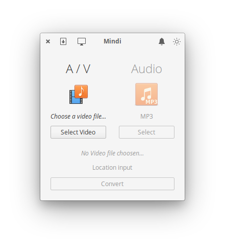
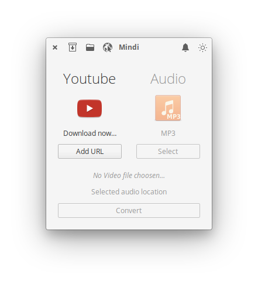
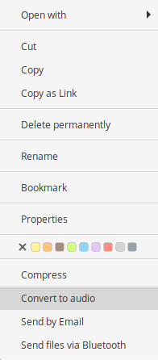

# A simple Audio converter designed for elementary OS

Quickly convert video to audio
Features:
- Use from context menu: right click on video, and select "Convert to Audio".
- Use from Applications select video.

## Building, Testing, and Installation

You'll need the following dependencies:

* meson
* libgranite-dev
* valac

Run `meson` to configure the build environment and then `ninja` to build and run automated tests

    meson build --prefix=/usr
    cd build
    ninja

To install, use `ninja install`, then execute with 'com.github.torikulhabib.mindi`

    sudo ninja install
    com.github.torikulhabib.mindi

## Credits
A lot of the code is inspired by the Artem Anufrij [imageburn](https://github.com/artemanufrij/imageburner) and Kirill Romanov [Formatter](https://github.com/Djaler/Formatter).
The icon is based on the [elementary icon](https://github.com/elementary/icons)
